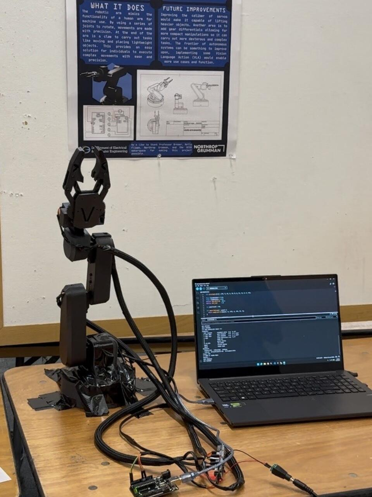

# Arduino Robotic Arm Controller

Serial command software for a six-servo robotic arm built for ECE 5 at UC Santa Barbara. The Arduino sketch maps commands to PCA9685 PWM outputs, tracks commanded joint angles, and moves servos incrementally toward target positions.

## Software features

- **Command interface:** select a servo channel and target angle through the Serial Monitor.
- **Incremental motion:** step one degree at a time with a configurable delay.
- **Input bounds:** reject channels outside 0–5 and angles outside 0–180.
- **State tracking:** store the latest commanded angle for each servo.
- **Homing:** return all six channels to configured home angles in sequence.
- **PWM mapping:** convert requested angles into configurable pulse counts.

## Stack

Arduino C++ · Wire / I²C · Adafruit PWM Servo Driver library · Arduino Uno · PCA9685

## Setup

1. Install the **Adafruit PWM Servo Driver** library through Arduino IDE's Library Manager.
2. Place `robotic_arm_controller.ino` in a folder named `robotic_arm_controller` and open it in Arduino IDE.
3. Connect the PCA9685 to the Uno over I²C, with a common ground and a suitable external servo supply. Check the driver and servo voltage specifications before powering the arm.
4. Review channel assignments, home angles, and pulse limits for your assembly. The sketch starts every channel at 90 degrees.
5. Select the Arduino Uno and its port, then upload the sketch.
6. Open the Serial Monitor at **9600 baud** with **Newline** selected.

## Commands

| Command | Behavior |
| --- | --- |
| `0 30` | Move channel 0 toward 30 degrees |
| `p` | Print stored commanded angles |
| `h` | Home all six channels |

### Channel mapping

| Channel | Assignment |
| --- | --- |
| 0 | Base |
| 1 | Shoulder |
| 2 | Elbow |
| 3 | Gripper |
| 4 | Extra servo 1 |
| 5 | Extra servo 2 |

## Implementation notes

`moveServoSmooth()` moves one channel at a time using one-degree steps. The default `SERVO_STEP_DELAY` is 20 ms per degree. PWM frequency is set to 60 Hz, and `SERVOMIN` / `SERVOMAX` define pulse mapping endpoints.

The controller is open loop: stored angles represent software commands, not measured joint positions. Motion uses blocking delays, so new commands wait while a movement completes. Numeric parsing uses Arduino `String::toInt()`; range checks are present, but malformed numeric text is not strictly validated. The published sketch implements manual commands and homing; it does not implement inverse kinematics or autonomous pick-and-place.

## Project files

- [Controller source](robotic_arm_controller.ino)
- [Completed arm photo](media/robotic-arm-final.jpeg)
- [Project poster](media/project-poster.jpeg)
